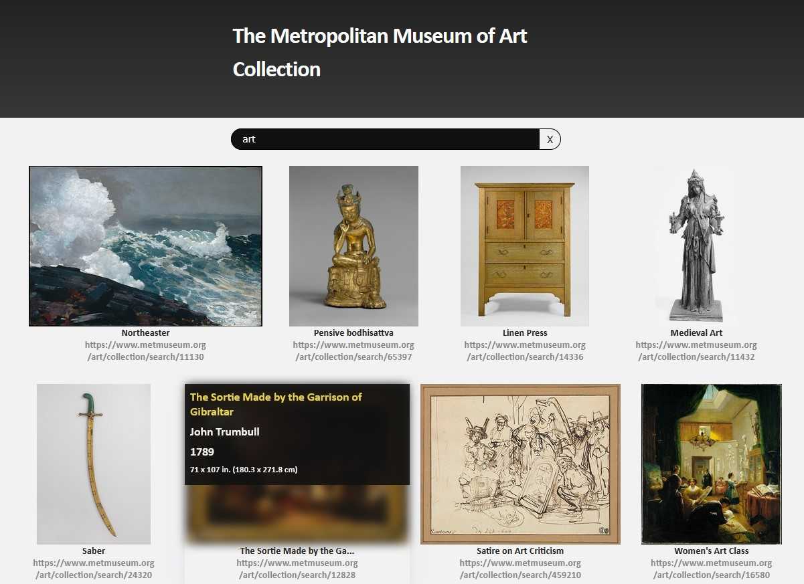

## Available Scripts

### `yarn start`

Runs the app in the development mode. 
Open [http://localhost:3000](http://localhost:3000) to view it in the browser.

## About

A frontend which consumes the Metropolitan Museum of Art API to search their collection.

Built using React

On load it requests a search query with a random keyword (from a predetermined list). This was done to populate the page with some interesting content a user may want to see. It does slow the initial page load down a bit, but if the purpose of the page is to showcase the Met's collection, this would be a good way to do so.

## Expanding the project

- Show multiple pages of results with pagination (or never ending scrolling)
- I would make the search more customizable and robust. Through the following:
  - The ability to see Highlights, or pieces on display only
  - Subfiltering by date range, geolocation, and per-department search
